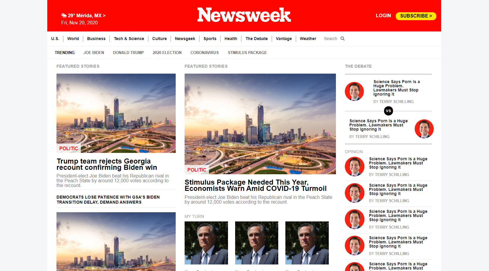

# 7 Using Bootstrap

> This project requests students to build a replica of the news site Newsweek.com using the Bootstrap framework.

## Built With

- HTML 5
- CSS 3

## Live Demo

[Live Demo Link](https://raw.githack.com/vichuge/7-using-bootstrap/feature/index.html)

## Getting Started

- Clone or download this project on your computer
- Open it with your favorite browser

## Authors

👤 **Victor Pacheco**

- GitHub: [@vichuge](https://github.com/vichuge)
- LinkedIn: [LinkedIn](https://www.linkedin.com/in/victor-pacheco-7946aab2/)

👤 **Alexis Varela**

- GitHub: [@alexisbec](https://github.com/alexisbec)
- LinkedIn: [LinkedIn](https://www.linkedin.com/in/alexis-varela-2584111b7/)

## 🤝 Contributing

Contributions, issues, and feature requests are welcome!

Feel free to check the [issues page](https://github.com/vichuge/7-using-bootstrap/issues).

## Show your support

Give a ⭐️ if you like this project!

## 📝 License

This project is [MIT](https://github.com/vichuge/7-using-bootstrap/blob/main/LICENSE) licensed.
